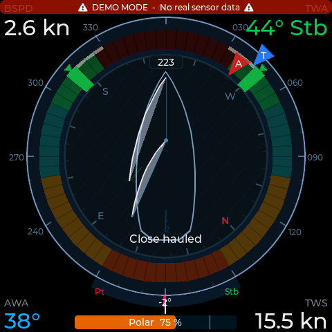
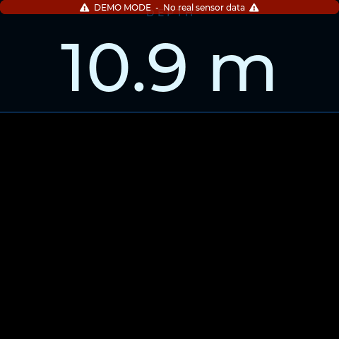
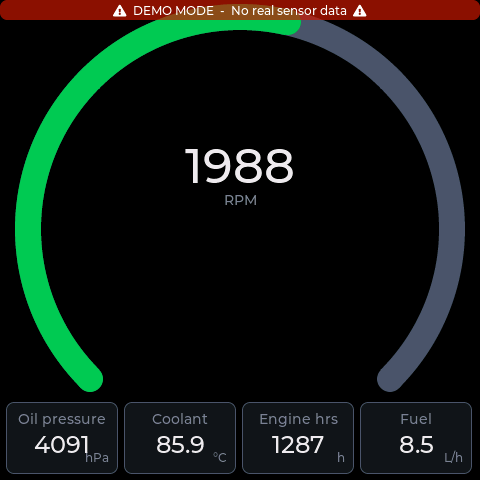
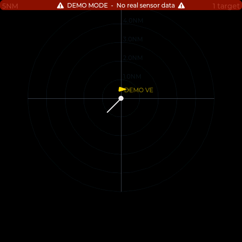
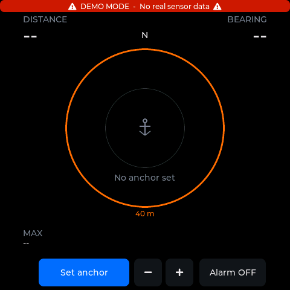
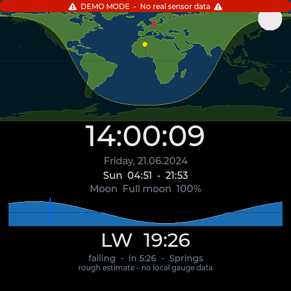
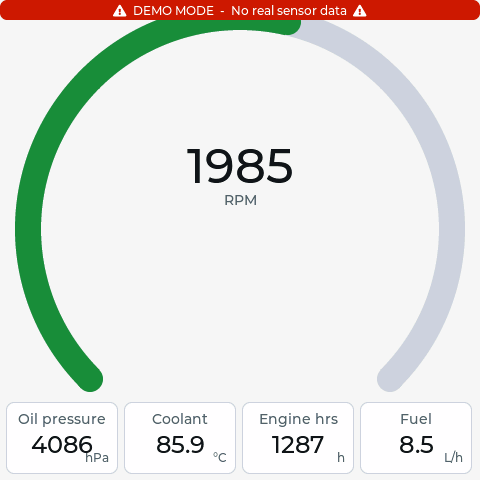
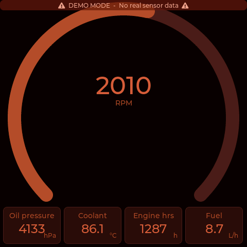

# NauticPinnace

A DIY **NMEA 2000 instrument display** for sailing yachts, built on the
**Waveshare ESP32-S3-Touch-LCD-4** (480 × 480 IPS touch panel, Rev 4).
It sits on the bus like a commercial multifunction instrument: wind, speed,
depth, engine, AIS, autopilot, batteries, tanks, weather, anchor watch and
more — 17 instrument screens plus up to 6 user-defined data grids, in
English and German, with dark, light and red-preserving night themes.

**About the name:** a *pinnace* is a ship's tender — the small boat that
belongs to a bigger ship and does the visible work alongside it. This project
is the tender to [**NauticPi**](https://github.com/Ranman86/NauticPi), the
author's Raspberry-Pi boat computer, and carries its mothership right in the
name: Nautic**Pi**nnace. Both run independently; together they make a
bus-powered instrument network without a single chartplotter involved.
(Pronounced "PINN-iss", if you want to sound salty.)

It requires an NMEA 2000 backbone (Raymarine SeaTalk-ng works with an adapter
cable — it is NMEA 2000 with proprietary connectors). There is no NMEA 0183
or classic SeaTalk input.

<p align="center">
  <picture>
    <source media="(prefers-color-scheme: light)" srcset="docs/img/wind_light.png">
    
  </picture>
  <br>
  <em>All screenshots in this README come from the PC simulator, which renders
  the same UI code as the device.</em>
</p>

> **⚠️ Please read before connecting this to a boat**
>
> This is a hobby project. It is **not NMEA-certified**, sold, or supported as
> a product — you build it, you are responsible for it. Connecting a
> self-built device to an NMEA 2000 backbone may have warranty implications
> for the certified equipment installed on that network. For exactly this
> case the firmware has a **listen-only mode**: it sends no messages (not
> even an address claim) and opens the CAN controller in hardware listen-only
> mode, so it doesn't even drive ACK bits — electrically passive. Listen-only
> is **off by default**: power the display from USB-C first and enable it in
> the settings before connecting the drop cable, if that's what you want.
> And obviously: this display is an aid, **not a navigation device** — never
> rely on it as your primary source for depth, position or collision
> avoidance.

---

## Screens

| | | |
|:---:|:---:|:---:|
|  |  |  |
| **Depth** — 96 px digits over a scrolling echo history, shallow-water alarm | **Engine** — RPM arc + 1–6 freely assignable value cards | **AIS** — radar-style target plot, tap a target for details, targets colour-coded by CPA/TCPA risk |
|  |  |  |
| **Anchor watch** — swing circle, drift track, radius alarm (fires on any screen) | **Clock** — world map with day/night terminator, sun/moon, tide curve | **Wind & Trim** — sail zones, hull with trimmed sails, polar target, trim advice |

All 17 fixed screens: **Wind & Trim** · **Speed** (SOG/STW/polar target/VMG) ·
**Depth** · **Engine** · **Rudder** · **AIS** · **Wind plot** (TWD/TWS history
rose) · **Autopilot** (commanded heading, mode, deviation) · **Fusion**
(remote control for a Fusion MS-RA670 stereo) · **Attitude** (artificial
horizon: roll/pitch, rate of turn, wave height/period estimated from heave) ·
**Anchor watch** · **Tanks** · **Batteries** (SoC, voltage, current, time
remaining per bank) · **Weather** (barometer + trend chart, temps, humidity) ·
**Clock** · **VMG** (live vs. best achievable, steer higher/lower) · **Route**
(waypoint distance/bearing, XTE bar, time to go).

On top of those you can add up to **6 data-grid screens**: free layouts up to
3 × 3 cells (plus "hero" layouts with one big value on top), each cell mapped
to any data point on the bus.

Screen **order and visibility are configurable**; navigation is by touch
swipe or on-screen arrows.

### Themes

| Light | Dark | Night |
|:---:|:---:|:---:|
|  |  |  |

Dark (default), light, and a red-preserving night mode, switchable on the
display; an optional auto mode switches between light (day) and dark (night)
by sun position (needs GPS + time from the bus) — the night theme is selected
manually. Every colour, size and font role of the dark and light themes is
editable in the web UI and applies live; the night palette can be customised
via config JSON import.

---

## Hardware

| | |
|---|---|
| Board | [Waveshare ESP32-S3-Touch-LCD-4](https://www.waveshare.com/wiki/ESP32-S3-Touch-LCD-4) **Rev 4** (16 MB flash, 8 MB PSRAM) |
| Display | ST7701S, 480 × 480 IPS, 16-bit parallel RGB |
| Touch | GT911 capacitive (the firmware auto-probes both known I²C addresses, 0x5D and 0x14 — units ship with either) |
| CAN | Onboard TJA1051 transceiver, wired to `CANH`/`CANL` on the 10-position screw terminal at the bottom edge |
| Power | Via the same screw terminal (`VIN`/`GND`) |

**Check the revision before buying.** Waveshare has shipped several hardware
revisions under the same product name. This firmware targets **Rev 4** (GT911
touch controller, CAN on GPIO 6/0). Earlier revisions use a different touch
controller and different CAN pins and will not work without adaptation — if
in doubt, ask the seller which revision they ship.

### Wiring

No extra CAN transceiver is needed — the drop cable lands directly on the
screw terminal. Standard NMEA 2000 cable colours:

| Drop cable | Screw terminal |
|---|---|
| White (CAN-H) | `CANH` |
| Blue (CAN-L) | `CANL` |
| Red (+12 V) | `VIN` |
| Black (GND) | `GND` |

Before powering from the bus, check the accepted input-voltage range for the
`VIN` terminal in the [Waveshare wiki](https://www.waveshare.com/wiki/ESP32-S3-Touch-LCD-4)
against your bus supply, and fuse the drop as usual. Per Waveshare's
documentation the board carries an **onboard 120 Ω termination resistor** —
an NMEA 2000 backbone must have exactly two terminators, so account for it
in your bus layout.

The firmware's CAN pins (TX = GPIO 6, RX = GPIO 0) are routed on the board to
the onboard transceiver — nothing for you to wire; the pin setting in the web
UI exists only for modified or future board revisions.

**Worth knowing:**

- **GPIO 0 is both CAN RX and the ESP32-S3 boot-strapping pin.** A CAN
  transceiver idles recessive (high), so normal boots are fine — but if a
  boot ever fails with the bus attached, detach it briefly. GPIO 0 also can't
  serve as a button anymore: bus traffic on the pin would register as a
  stream of button presses, so navigation is touch-only.

---

## Building and flashing

Install [PlatformIO](https://platformio.org/) (VS Code extension or CLI) and
connect the board via USB-C — no boot-button dance needed. The default
environment is the board; the simulator is opt-in via `-e simulator`.

```bash
pio run -t deploy
```

`deploy` is a custom target that uploads the LittleFS image (web UI, factory
config, polar) and then the firmware — **as two separate steps, in the right
order**. (Don't combine `-t uploadfs -t upload` in one invocation; PlatformIO
resolves both to the filesystem image and silently skips the firmware.)

Day-to-day, firmware only:

```bash
pio run -t upload
```

> **Note:** `uploadfs` rewrites the whole LittleFS partition from `data/`,
> which resets the on-device configuration to factory state — WiFi
> credentials cleared, English, demo mode on, and the first-run flow (below)
> appears again. Export your config first (web UI → Import/Export) if you
> want to restore it afterwards.

On Windows there is also `build_deploy.ps1` (interactive menu or
`-FullDeploy`, `-FsOnly`, `-Build`, `-Simulator`, `-Monitor`, `-Clean`); it
can auto-download SDL2 and copies the simulator's runtime DLLs next to the
exe from an existing MinGW/MSYS2 install.

**First boot:** the display starts in English, asks for your language, shows
the licence screen, and generates its WiFi hotspot password.

### Flashing without PlatformIO

You don't need a toolchain just to try the firmware:

- **Browser (easiest):** open the
  [web flasher](https://ranman86.github.io/NauticPinnace/flash.html) in
  Chrome or Edge, plug the display in via USB-C, click *Install*. Uses
  WebSerial via [ESP Web Tools](https://esphome.github.io/esp-web-tools/).
- **Release package:** grab the ZIP from the
  [Releases](https://github.com/Ranman86/NauticPinnace/releases) page. On
  Windows, double-click `flash.bat` (a standalone `esptool.exe` is bundled —
  nothing to install); on Linux/macOS, `pip install esptool` and run
  `flash.sh`. Details in the included `FLASHING.md`.

The script paths **erase the entire 16 MB flash first**, then write bootloader,
firmware and web UI — so the device really starts from a factory state rather
than new firmware layered on old leftovers (the erase also clears the NVS area
the ESP-IDF uses for WiFi calibration and cached credentials). The whole run
takes about half a minute. The browser flasher offers the erase as a prompt on
first install instead of always doing it.

`FLASHING.md` in the release package documents the firmware-only command if you
want to update while keeping your configuration.

<details>
<summary>Maintainer notes</summary>

Build a release with `python tools/make_release.py --version vX.Y.Z`. It
compiles firmware + LittleFS, assembles `release/NauticPinnace-vX.Y.Z/`
(images, `flash.bat` with a bundled `esptool.exe`, `flash.sh`,
`manifest.json`, `FLASHING.md`, licences), zips it, and refreshes the web
flasher payload in `docs/flash/`. Upload the ZIP to the GitHub release.

The web flasher needs GitHub Pages enabled: *Settings → Pages → Source:
deploy from branch `main`, folder `/docs`*. Until then the link above 404s.

Flash layout (from `partitions_16MB.csv`): bootloader `0x0`, partition table
`0x8000`, boot_app0 `0xe000`, firmware `0x10000`, LittleFS `0xA10000`.
</details>

**No boat? Try it anyway.** The factory config ships with **demo mode** on:
all screens run on animated synthetic data (marked by a demo banner) until
you turn it off in the web UI — so a bare board on a desk shows the full
instrument set. Or skip the hardware entirely and use the PC simulator.

### PC simulator

The full UI runs on a PC — same screens, same config code, demo data:

```bash
pio run -e simulator
.pio/build/simulator/program.exe
```

On Windows it needs SDL2 (`C:/SDL2` by default; paths adjustable in
`platformio.ini`) plus `SDL2.dll` and three MinGW runtime DLLs next to the
exe (`build_deploy.ps1 -Simulator` sets all of this up). On Linux, install
`libsdl2-dev` and adjust the paths — the simulator is developed and tested on
Windows. Useful flags: `--screen N`, `--light/--dark/--night`, `--de/--en`,
`--firstrun` (first-boot flow), `--nodemo` (empty data model), `--selftest`
(automated first-run regression test), `--cfg <path>`.

---

## Configuration

**On the display:** tap the gear button — WiFi on/off, network credentials,
hotspot mode with QR code, theme, NMEA 2000 listen-only switch, licences.

**Web UI:** enable WiFi and either join your network or use the built-in
hotspot (SSID `NauticPinnace` + 6 MAC digits; password shown on the display —
scan the QR code to join). In hotspot mode the display is at
`http://192.168.4.1`; when joined to your network, its IP is shown in the
settings menu. Tabs:

- **Live** — 16 key bus values at a glance (polled once per second)
- **WiFi** — client/hotspot mode, credentials
- **Display** — brightness, screen order & visibility, per-screen settings,
  data-grid editor, demo mode
- **Appearance** — dark/light theme colours, font sizes and dimensions, applies
  live
- **NMEA 2000** — listen-only mode, CAN pins (for modified boards)
- **Polar** — polar table editor with CSV import/export (target speeds drive
  the performance bar, VMG optimisation and trim advice). The firmware ships
  with a generic example polar — get one for your actual boat, e.g. free per
  boat model from [weatherrouting.online](https://weatherrouting.online/),
  from ORC speed guides, or from your boat's manufacturer, and import it here
- **Boot logo** — title line (defaults to "NauticPinnace"), optional boat name
  underneath, and an upload slot for your own logo. The upload takes a
  pre-converted raw RGB565 `.bin`, not a PNG — `tools/logo_convert.py` does the
  conversion. Without one, a built-in vector mark is drawn.
- **Import/Export** — full config backup/restore as JSON, restart

WiFi is **off by default** — on a boat without shore WiFi it would only cost
boot time. Every instrument screen works without it — but two things do need
WiFi: the clock only sets itself from the internet (no RTC battery on this
board), and the tide curve comes from an online forecast. Both simply stay
empty when the radio is off.

### Security

- The hotspot password is **random per device** (12 characters, ~68 bit),
  generated on first boot from the hardware RNG mixed with an entropy pool
  fed by your touches during initial setup. It is shown only on the display
  (settings + QR code) and never printed to the serial log. It is *not*
  derived from the MAC address — a scheme like that would be computable by
  anyone in radio range, since the AP beacon broadcasts the MAC.
- The HTTP API has **no authentication**, and the config endpoints
  (`/api/config`, `/api/export`) return the stored WiFi credentials —
  including the hotspot password. **Anyone who can reach the display's IP can
  read and change everything.** The WPA2 hotspot password is the security
  boundary. If you join the display to an existing network instead, make
  sure it is one you trust.

---

## NMEA 2000

Built on Timo Lappalainen's [NMEA2000](https://github.com/ttlappalainen/NMEA2000)
library. The CAN driver in `lib/NMEA2000_esp32` is an independent
implementation on the ESP-IDF TWAI API (the upstream ESP32 driver predates
the S3); its public interface deliberately mirrors the upstream library for
drop-in compatibility.

By default the device joins the bus as a normal node (address claim,
heartbeat, source address preference 42). In **listen-only mode** it sends
nothing — no address claim, no heartbeat — and the CAN controller itself is
opened in hardware listen-only mode, so it doesn't even acknowledge frames:
electrically passive. Use it on charter boats, other people's boats, or
wherever you don't want a non-certified transmitter on the backbone. Toggle
it in the on-screen settings or the web UI (reboots to apply). The only
functional loss: the Fusion stereo remote becomes read-only.

<details>
<summary><strong>PGNs received</strong> (34)</summary>

| PGN | Data |
|---|---|
| 126992 | System time |
| 127237 | Heading/track control (autopilot) |
| 127245 | Rudder angle |
| 127250 | Vessel heading |
| 127251 | Rate of turn |
| 127252 | Heave |
| 127257 | Attitude (roll/pitch/yaw) |
| 127258 | Magnetic variation |
| 127488 | Engine parameters, rapid (RPM) |
| 127489 | Engine parameters, dynamic (oil pressure, coolant temp, fuel rate, hours) |
| 127505 | Fluid level (tanks) |
| 127506 | DC detailed status (SoC, time remaining) |
| 127508 | Battery status |
| 128259 | Speed through water |
| 128267 | Water depth |
| 128275 | Distance log |
| 129025 | Position, rapid update |
| 129026 | COG & SOG, rapid update |
| 129029 | GNSS position data |
| 129033 | Local time offset |
| 129038 / 129039 | AIS class A / B position reports |
| 129283 | Cross-track error |
| 129284 | Navigation data (waypoint) |
| 129794 | AIS class A static & voyage data |
| 129809 | AIS class B static data (129810 is received but not yet decoded) |
| 130306 | Wind |
| 130310 / 130311 / 130314 | Environment (temps, humidity, pressure) |
| 130312 | Temperature, extended |
| 130320 | Tide station data (hand-decoded) |
| 130820 | Fusion stereo status (proprietary) |

</details>

**Transmitted:** application code sends only PGN 126720 (proprietary
commands to a Fusion MS-RA670 stereo: source, volume, transport), and only
when listen-only is off. In node mode the library additionally handles the
usual protocol traffic (address claim, heartbeat).

---

## Status

Honest state of affairs for a first release:

- The **receive path is verified against a real boat bus** (B&G Precision-9,
  wind/depth/log transducers, battery and tank senders, AIS, Fusion status —
  developed against a CAN bench simulator, then confirmed on the author's
  Beneteau Oceanis 350).
- The **Fusion control opcodes** (PGN 126720) come from community reverse
  engineering (canboat/Signal K) and are **not yet fully validated against
  real hardware** — status decoding works, control commands may need
  adjustment.
- AIS targets are colour-coded by **hardcoded CPA/TCPA thresholds**; the
  alarm thresholds already present in the config are not evaluated yet.
- AIS PGN 129810 (class B static, part B) is received but not decoded.
- The HTTP config API is unauthenticated (see Security).

## How this was built

Full disclosure: this project was **vibe-coded** — large parts of the
firmware were designed, written and debugged in pair with an AI assistant
(Anthropic's Claude), with a human sailor at the helm making the decisions,
holding the crimping tool and testing against the real bus. The code has
been reviewed and it runs on the author's boat, but it has not had a classic
line-by-line human audit. Read it with the same healthy scepticism you'd
apply to any hobby firmware — and see the warning at the top before wiring
it to your backbone.

## Issues & contributions

Bug reports and pull requests are welcome — this is spare-time work, so no
guaranteed response times. Especially valuable: **PGN 130820/126720 captures
from a real Fusion radio**, reports from other board batches/revisions, and
real-boat field reports. For firmware issues please attach the serial log
(115200 baud) and, for bus problems, a PGN dump if you can get one.

**Help wanted — Navico BSM-1:** current MFD software has dropped support for
this sounder module (including on the repository owner's plotter), so the
BSM-1 needs reverse engineering and a fresh integration. If you know its
protocol or have one on your bench, please get in touch.

---

## Repository layout

```
src/            firmware (LVGL 8.4 UI, N2K handlers, config, web server)
sim/            SDL2 PC simulator shims
data/           LittleFS image: web UI, factory config.json, polar.json
lib/NMEA2000_esp32/  TWAI-based CAN driver (ESP32-S3 compatible)
boards/         PlatformIO board definition for the Waveshare panel
tools/          generators: LVGL fonts (Montserrat subsets), hull outline
                from an image, world map mask, boot-logo converter
docs/img/       simulator screenshots used in this README
download/fonts/ unmodified Montserrat TTFs + OFL.txt (source of the fonts)
```

`extra_script.py` (ccache + the `deploy` target) and `partitions_16MB.csv`
are used by PlatformIO automatically; `deploy.bat` is a thin wrapper around
`build_deploy.ps1`.

---

## Licence

The project's own code is **MIT** (see [LICENSE](LICENSE)).

Bundled third-party components keep their own licences — the complete list
with obligations lives in
[THIRD-PARTY-NOTICES.md](THIRD-PARTY-NOTICES.md), full texts in
[`LICENSES/`](LICENSES/). Highlights: LVGL, ArduinoJson, NMEA2000,
LovyanGFX (MIT/BSD); Montserrat and the generated bitmap fonts (SIL OFL 1.1);
Arduino-ESP32 core, AsyncTCP and ESPAsyncWebServer (LGPL — **if you
distribute a built `firmware.bin`, the LGPL relink obligations apply**; see
the notices file).

Data: world map from Natural Earth (public domain); tide forecast at runtime
from BSH (CC BY 4.0, credited on screen); NMEA 2000 field layouts as facts
from the [canboat](https://github.com/canboat/canboat) project. The shipped
polar table holds generic example values — import your own boat's polar
(e.g. from [weatherrouting.online](https://weatherrouting.online/)) via the
web UI. The hull silhouette is hand-drawn.

Fair winds! ⛵
