# NauticPinnace

A DIY **NMEA 2000 instrument display** for sailing yachts, running on three
**Waveshare ESP32-S3** touch boards: the 4-inch (480 × 480) and the two
1024 × 600 panels, 7-inch and 5-inch (see [Hardware](#hardware)).
It sits on the bus like a commercial multifunction instrument: wind, speed,
depth, engine, AIS, autopilot, batteries, tanks, weather, anchor watch and
more — 17 instrument screens plus up to 6 user-defined data grids, in
English and German, with dark, light and red-preserving night themes.

**About the name:** a *pinnace* is a ship's tender — the small boat that
belongs to a bigger ship and does the visible work alongside it. This project
is the tender to [**NauticPi**](https://github.com/Ranman86/NauticPi), the
author's Raspberry-Pi boat computer, and carries its mothership right in the
name: Nautic**Pi**nnace. Both run independently; together they make a
bus-powered instrument network without a single chartplotter involved.
(Pronounced "PINN-iss", if you want to sound salty.)

It requires an NMEA 2000 backbone (Raymarine SeaTalk-ng works with an adapter
cable — it is NMEA 2000 with proprietary connectors). There is no NMEA 0183
or classic SeaTalk input.

What changed between releases is in [CHANGELOG.md](CHANGELOG.md). The version
a device is actually running is on its boot screen, under **Update** in the web
interface, and in the device list of any chartplotter on the bus.

<p align="center">
  <picture>
    <source media="(prefers-color-scheme: light)" srcset="docs/img/wind_light.png">
    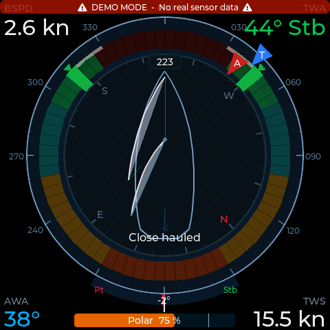
  </picture>
  <br>
  <em>All screenshots in this README come from the PC simulator, which renders
  the same UI code as the device.</em>
</p>

> **⚠️ Please read before connecting this to a boat**
>
> This is a hobby project. It is **not NMEA-certified**, sold, or supported as
> a product — you build it, you are responsible for it. Connecting a
> self-built device to an NMEA 2000 backbone may have warranty implications
> for the certified equipment installed on that network. For exactly this
> case the firmware has a **listen-only mode**: it sends no messages (not
> even an address claim) and opens the CAN controller in hardware listen-only
> mode, so it doesn't even drive ACK bits — electrically passive. Listen-only
> is **off by default**: power the display from USB-C first and enable it in
> the settings before connecting the drop cable, if that's what you want.
> And obviously: this display is an aid, **not a navigation device** — never
> rely on it as your primary source for depth, position or collision
> avoidance.

---

## Screens

| | | |
|:---:|:---:|:---:|
| <picture><source media="(prefers-color-scheme: dark)" srcset="docs/img/wind_dark.png">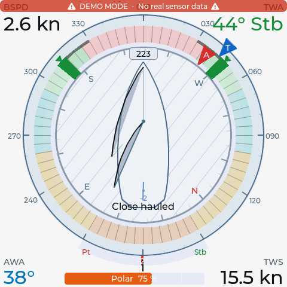</picture> | <picture><source media="(prefers-color-scheme: dark)" srcset="docs/img/speed_dark.png">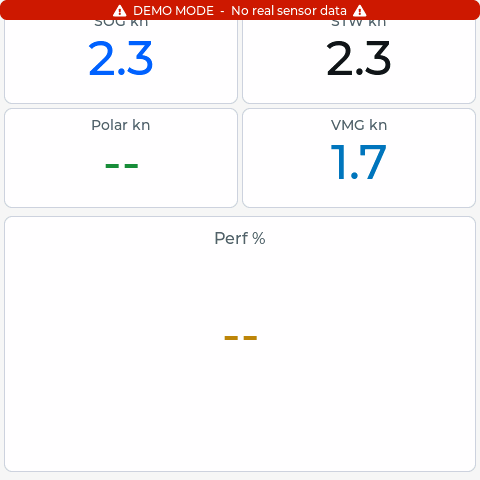</picture> | <picture><source media="(prefers-color-scheme: dark)" srcset="docs/img/vmg_dark.png">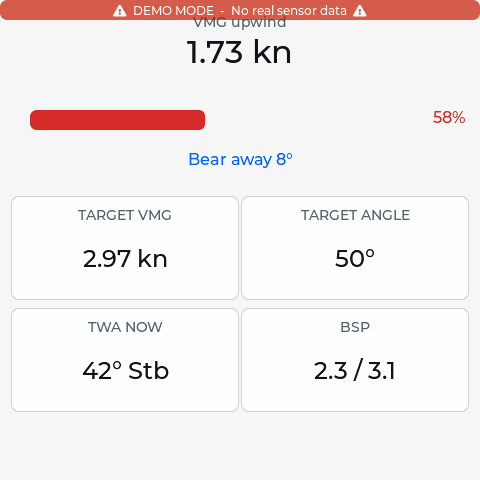</picture> |
| **Wind &amp; Trim**<br>sail zones, hull with trimmed sails, polar target, trim advice | **Speed**<br>SOG and STW against the polar target, performance bar | **VMG**<br>live vs. best achievable, optimal TWA, steer higher/lower |
| <picture><source media="(prefers-color-scheme: dark)" srcset="docs/img/depth_dark.png">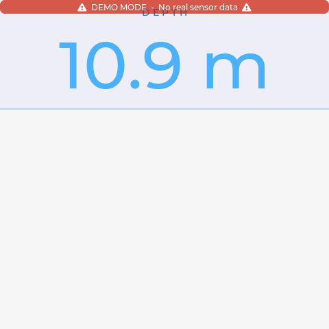</picture> | <picture><source media="(prefers-color-scheme: dark)" srcset="docs/img/windplot_dark.png">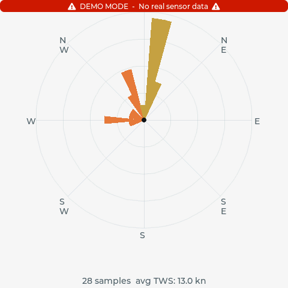</picture> | <picture><source media="(prefers-color-scheme: dark)" srcset="docs/img/route_dark.png">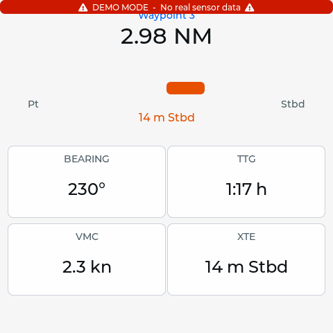</picture> |
| **Depth**<br>96 px digits over a scrolling echo history, shallow alarm | **Wind plot**<br>TWD/TWS history as a polar rose with statistics | **Route**<br>distance and bearing to the waypoint, XTE bar, time to go |
| <picture><source media="(prefers-color-scheme: dark)" srcset="docs/img/ais_dark.png">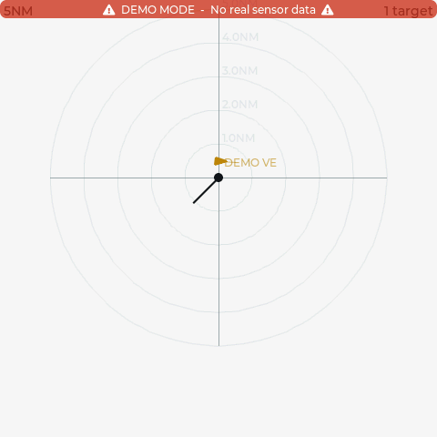</picture> | <picture><source media="(prefers-color-scheme: dark)" srcset="docs/img/anchor_dark.png">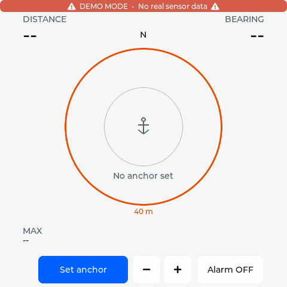</picture> | <picture><source media="(prefers-color-scheme: dark)" srcset="docs/img/attitude_dark.png">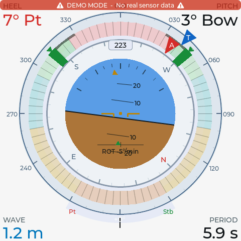</picture> |
| **AIS radar**<br>target plot, tap a target for details, CPA/TCPA colouring | **Anchor watch**<br>swing circle, drift track, radius alarm on any screen | **Attitude**<br>artificial horizon, rate of turn, wave height and period |
| <picture><source media="(prefers-color-scheme: dark)" srcset="docs/img/engine_dark.png">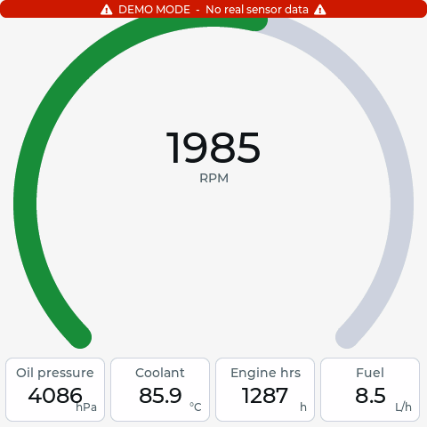</picture> | <picture><source media="(prefers-color-scheme: dark)" srcset="docs/img/tanks_dark.png">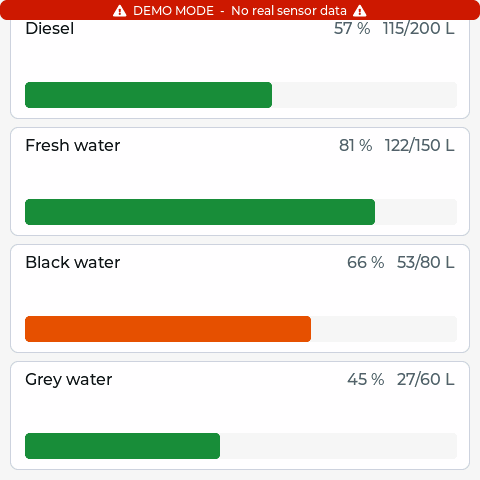</picture> | <picture><source media="(prefers-color-scheme: dark)" srcset="docs/img/battery_dark.png">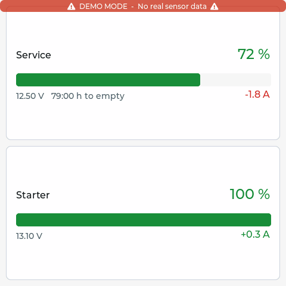</picture> |
| **Engine**<br>RPM arc plus 1-6 freely assignable value cards | **Tanks**<br>one bar per fluid tank on the bus, calibrated per tank | **Batteries**<br>state of charge, voltage, current, time remaining per bank |
| <picture><source media="(prefers-color-scheme: dark)" srcset="docs/img/autopilot_dark.png">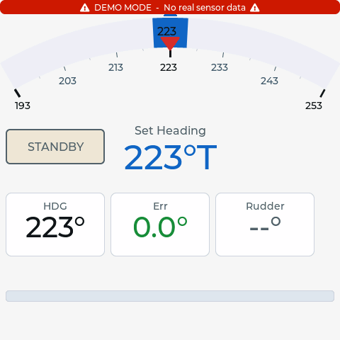</picture> | <picture><source media="(prefers-color-scheme: dark)" srcset="docs/img/rudder_dark.png">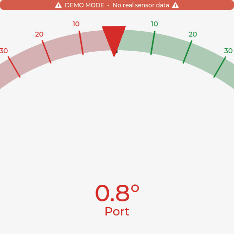</picture> | <picture><source media="(prefers-color-scheme: dark)" srcset="docs/img/weather_dark.png">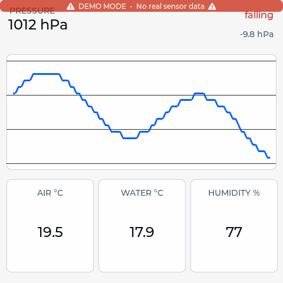</picture> |
| **Autopilot**<br>commanded heading, mode badge, deviation and rudder | **Rudder**<br>rudder angle band with value and direction | **Weather**<br>barometer with 3 h trend, air and water temperature |
| <picture><source media="(prefers-color-scheme: dark)" srcset="docs/img/clock_dark.png">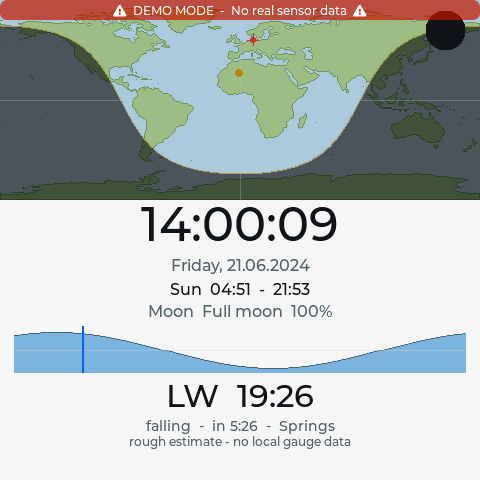</picture> | <picture><source media="(prefers-color-scheme: dark)" srcset="docs/img/media_dark.png">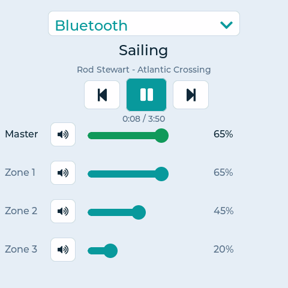</picture> | <picture><source media="(prefers-color-scheme: dark)" srcset="docs/img/grid_dark.png">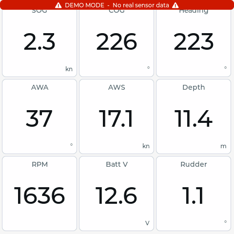</picture> |
| **Clock**<br>world map with day/night terminator, sun, moon, tide curve | **Media**<br>stereo remote (NMEA 2000, manufacturer code 419): source, now playing, transport, master and zone volumes | **Data grid**<br>your own layout, any bus value per cell, up to 6 of them |

That is all 17 fixed screens, plus one **data grid** in the last cell. Every
shot exists in light and dark and follows your GitHub theme, so what you see
above is what the display looks like in your preferred one.

You can add up to **6 data grids** of your own: free layouts up to 3 × 3
cells (plus "hero" layouts with one big value on top), each cell mapped to
any data point on the bus.

Screen **order and visibility are configurable**; navigation is by touch
swipe or on-screen arrows.

### Themes

| Light | Dark | Night |
|:---:|:---:|:---:|
|  | 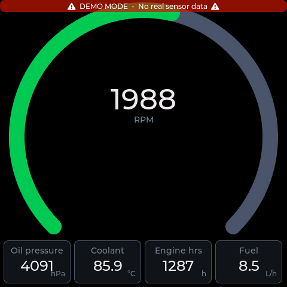 | 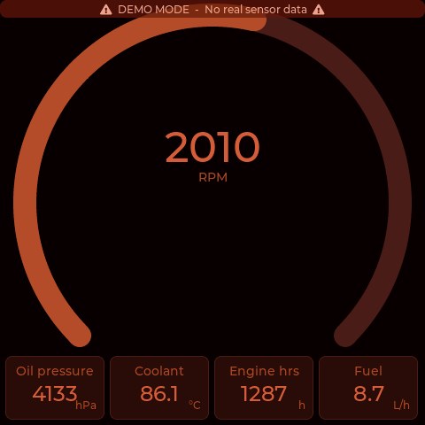 |

Night mode keeps everything on the red channel so it doesn't wreck your dark
adaptation on a night watch:

| | | | | |
|:---:|:---:|:---:|:---:|:---:|
| 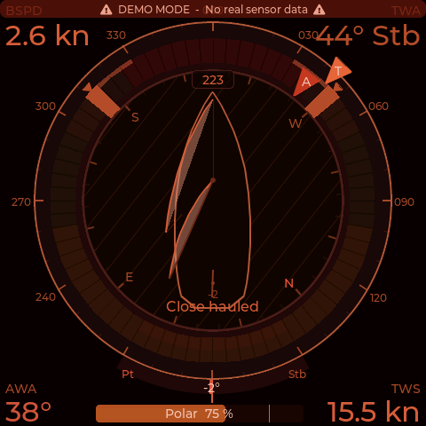 | 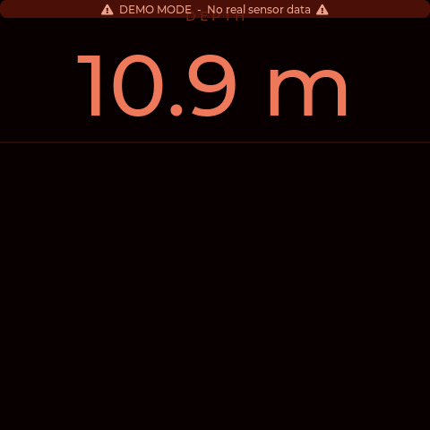 | 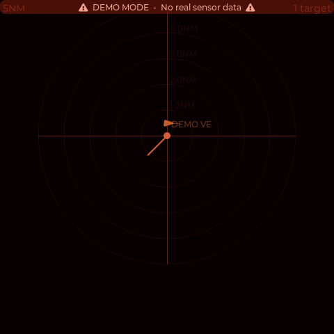 | 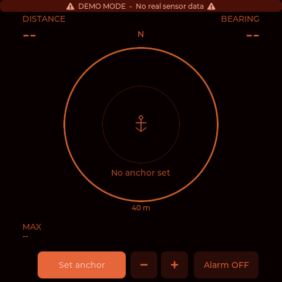 | 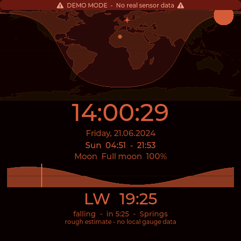 |

Dark (default), light, and night are switchable on the display; an optional
auto mode switches between light (day) and dark (night) by sun position
(needs GPS + time from the bus) — the night theme is selected manually. Every colour, size and font role of the dark and light themes is
editable in the web UI and applies live; the night palette can be customised
via config JSON import.

### On the 1024 × 600 boards

The screenshots above are the 4-inch board's 480 × 480 square. The 7-inch and
5-inch panels are not that picture stretched: the instrument keeps a 600 × 600
square of its own and the extra width becomes permanent furniture — a
navigation rail on the left, and a sidebar of up to eight freely configured
value cells on the right, so the numbers you always want are never a swipe
away.

<p align="center">
  <picture>
    <source media="(prefers-color-scheme: dark)" srcset="docs/img/hires/wind_trim_dark_landscape.png">
    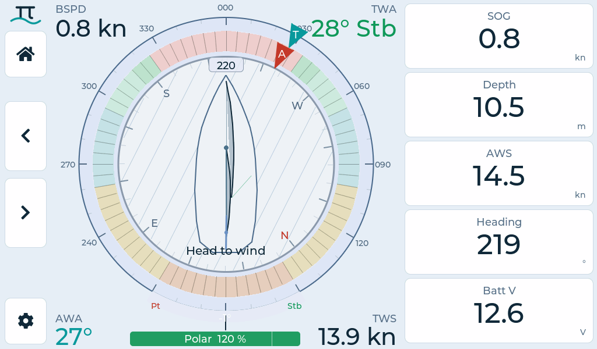
  </picture>
  <br>
  <em><strong>Wind &amp; Trim</strong> on 1024 × 600 — rail, instrument, sidebar.</em>
</p>

The rail's home button opens a launcher showing every active screen as a
labelled tile, so you can jump straight to one instead of swiping through the
carousel.

<p align="center">
  <picture>
    <source media="(prefers-color-scheme: dark)" srcset="docs/img/hires/home_dark_landscape.png">
    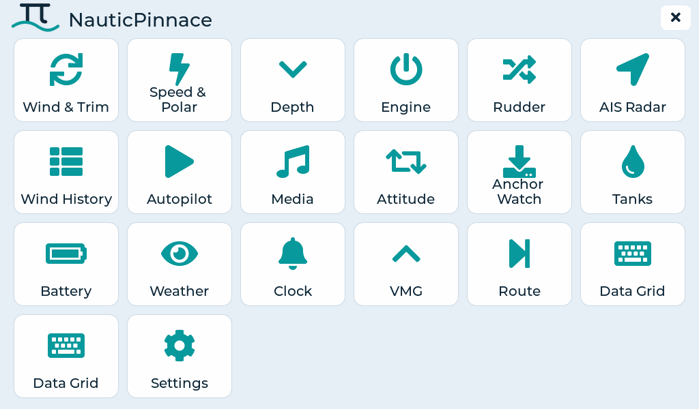
  </picture>
  <br>
  <em><strong>Home launcher</strong> — one tile per active screen, plus settings.</em>
</p>

Mounted upright, the rail moves to the top and the sidebar becomes a band
along the bottom; the instrument keeps its square either way. The full set —
every screen, all three themes, both orientations — is in
[`docs/img/hires/`](docs/img/hires/), and `tools\gen_docs_shots.ps1`
regenerates it.

---

## Hardware

The firmware runs on **three Waveshare ESP32-S3 boards**. All of them carry
16 MB flash and 8 MB PSRAM; what differs is the panel and how the console and
the CAN bus are wired.

| | 4-inch (released) | 7B | 5B |
|---|---|---|---|
| Board | [ESP32-S3-Touch-LCD-4](https://www.waveshare.com/wiki/ESP32-S3-Touch-LCD-4) **Rev 4** | [ESP32-S3-Touch-LCD-7B](https://www.waveshare.com/esp32-s3-touch-lcd-7b.htm) | [ESP32-S3-Touch-LCD-5B](https://www.waveshare.com/esp32-s3-touch-lcd-5.htm) |
| Display | ST7701S, 480 × 480 | ST7262, 1024 × 600, 7", ~170 ppi | ST7262, 1024 × 600, 5", ~240 ppi |
| Touch | GT911 (auto-probes 0x5D and 0x14) | GT911 @ 0x5D | GT911 @ 0x5D |
| CAN | GPIO 6/0 | GPIO 20/19, behind a USB/CAN mux | GPIO 15/16, no mux |
| Console | native USB CDC | CH343 bridge, **UART DIP switch must be on UART1** | native USB CDC |
| Extras | — | — | RTC (PCF85063A, coin cell), SD card, RS485, 2× isolated DI/DO, 7–36 V input |
| PlatformIO env | `waveshare_esp32s3_4` | `waveshare_esp32s3_7b` | `waveshare_esp32s3_5b` |

Both 1024 × 600 boards share the same user interface — a nav rail on the left,
the instrument in a 600 × 600 centre column and a configurable data sidebar on
the right. That layout is selected by the `BOARD_PANEL_1024X600` build flag,
not by the board identity, so the two boards share every line of UI code; only
the pin headers (`src/BoardConfig_*.h`) differ. At 5 inches the same pixels are
about 30 % smaller in millimetres than at 7 inches — the nav rail measures
9.3 mm instead of 13 mm.

**On the 4-inch board, check the revision before buying.** Waveshare has
shipped several hardware revisions under the same product name. This firmware
targets **Rev 4** (GT911 touch controller, CAN on GPIO 6/0). Earlier revisions
use a different touch controller and different CAN pins and will not work
without adaptation — if in doubt, ask the seller which revision they ship.

### Wiring

No extra CAN transceiver is needed — the drop cable lands directly on the
screw terminal. Standard NMEA 2000 cable colours:

| Drop cable | Screw terminal |
|---|---|
| White (CAN-H) | `CANH` |
| Blue (CAN-L) | `CANL` |
| Red (+12 V) | `VIN` |
| Black (GND) | `GND` |

Before powering from the bus, check the accepted input-voltage range for the
`VIN` terminal in the [Waveshare wiki](https://www.waveshare.com/wiki/ESP32-S3-Touch-LCD-4)
against your bus supply, and fuse the drop as usual. Per Waveshare's
documentation the board carries an **onboard 120 Ω termination resistor** —
an NMEA 2000 backbone must have exactly two terminators, so account for it
in your bus layout.

The firmware's CAN pins (TX = GPIO 6, RX = GPIO 0) are routed on the board to
the onboard transceiver — nothing for you to wire; the pin setting in the web
UI exists only for modified or future board revisions.

**Worth knowing:**

- **GPIO 0 is both CAN RX and the ESP32-S3 boot-strapping pin.** A CAN
  transceiver idles recessive (high), so normal boots are fine — but if a
  boot ever fails with the bus attached, detach it briefly. GPIO 0 also can't
  serve as a button anymore: bus traffic on the pin would register as a
  stream of button presses, so navigation is touch-only.

---

## Building and flashing

**Just want it on a board?** You do not need any of this — the
[browser flasher](https://ranman86.github.io/NauticPinnace/flash.html) writes a
prebuilt image over USB, no toolchain involved.

### What you need to build it

| | Why |
|---|---|
| [PlatformIO](https://platformio.org/) | Builds everything. VS Code extension (brings its own Python) or the CLI installer. |
| [Git](https://git-scm.com/downloads) | **Not optional.** Several libraries are pinned to specific commits and fetched with git, and the 7-inch/5-inch platform refuses to load without it. Only the PC simulator builds without git. |
| ~4 GB free (4-inch) / ~8 GB (7B, 5B) | The first build downloads complete toolchains. The 4-inch keeps a second, private copy on purpose — see the note in `platformio.ini`. |

`deploy.bat` checks all of this before it compiles and tells you what is
missing, so you can also just run it and follow what it says.

Two things bite specifically on a **freshly set up Windows**, and neither is
your fault:

- **A space in your Windows user name.** The 7-inch and 5-inch builds recompile
  the Arduino IDF layer, and that step refuses any space in its paths — which
  includes `C:\Users\Hans Meier\.platformio\packages\…`. `deploy.bat` detects
  this and redirects to `C:\pio` for the run. To fix it once and for all,
  create `C:\.platformio` *before* installing PlatformIO: it prefers a
  drive-root directory over your home folder.
- **Windows path length.** The 7-inch and 5-inch pull in an Arduino package
  that carries the whole Matter/connectedhomeip tree; its longest file needs
  232 characters of room, and unpacking it under
  `C:\Users\<you>\.platformio\.cache\…` overruns the 260-character limit.
  It fails as `FileNotFoundError: No such file or directory` naming a file
  PlatformIO was trying to *create* — which looks like anything except a path
  length problem. `deploy.bat` recognises it and redirects to `C:\pio` for the
  run. The permanent fix, once, in an **admin** PowerShell followed by a
  reboot:
  ```powershell
  New-ItemProperty 'HKLM:\SYSTEM\CurrentControlSet\Control\FileSystem' -Name LongPathsEnabled -Value 1 -PropertyType DWORD -Force
  ```
- **The 7-inch needs a driver.** It talks through a CH343 bridge; without the
  [WCH driver](https://www.wch-ic.com/downloads/CH343SER_EXE.html) Windows
  gives it no COM port at all and it simply will not appear in the port list.
  The 4-inch and the 5-inch use the ESP32-S3's own USB and need nothing.

### Building

Connect the board via USB-C — no boot-button dance needed. The default
environment is the 4-inch board; pick another with `-e`, or let `deploy.bat`
ask you.

```bash
pio run -t deploy
```

`deploy` is a custom target that uploads the LittleFS image (web UI, factory
config, polar) and then the firmware — **as two separate steps, in the right
order**. (Don't combine `-t uploadfs -t upload` in one invocation; PlatformIO
resolves both to the filesystem image and silently skips the firmware.)

Day-to-day, firmware only:

```bash
pio run -t upload
```

> **Note:** `uploadfs` rewrites the whole LittleFS partition from `data/`,
> which resets the on-device configuration to factory state — WiFi
> credentials cleared, English, demo mode off, and the first-run flow (below)
> appears again. Export your config first (web UI → Import/Export) if you
> want to restore it afterwards.

On Windows there is also `build_deploy.ps1` (interactive menu or
`-FullDeploy`, `-FsOnly`, `-Build`, `-Simulator`, `-Monitor`, `-Clean`); it
can auto-download SDL2 and copies the simulator's runtime DLLs next to the
exe from an existing MinGW/MSYS2 install.

**First boot:** the display starts in English, asks for your language, shows
the licence screen, and generates its WiFi hotspot password.

### Flashing without PlatformIO

You don't need a toolchain just to try the firmware:

- **Browser (easiest):** open the
  [web flasher](https://ranman86.github.io/NauticPinnace/flash.html) in
  Chrome or Edge, plug the display in via USB-C, click the button for your
  board. All three are offered. Uses WebSerial via
  [ESP Web Tools](https://esphome.github.io/esp-web-tools/).
  **Pick the right board:** all three are ESP32-S3 and indistinguishable over
  USB, so the browser cannot choose for you, and the wrong firmware leaves the
  screen dark until you flash the right one.
- **Release package (all three boards):** grab the ZIP from the
  [Releases](https://github.com/Ranman86/NauticPinnace/releases) page. It
  holds one folder per board — `4/`, `7b/`, `5b/` — and flash scripts that
  ask which board is connected; as in the browser, the wrong choice leaves
  the screen dark. On Windows, double-click `flash.bat` (a standalone
  `esptool.exe` is bundled — nothing to install); on Linux/macOS,
  `pip install "esptool>=4.8,<6"` and run `sh flash.sh`. Both also take the board and
  the port as arguments: `.\flash.bat 7b COM5`, `sh flash.sh 7b /dev/ttyACM0`.
  Details — including the 7-inch's USB driver and a fallback for the
  5-inch — in the included `FLASHING.md`.

The script paths **erase the entire 16 MB flash first**, then write bootloader,
firmware and web UI — so the device really starts from a factory state rather
than new firmware layered on old leftovers (the erase also clears the NVS area
the ESP-IDF uses for WiFi calibration and cached credentials). The whole run
takes about a minute. The browser flasher offers the erase as a prompt on
first install instead of always doing it.

To update while keeping your configuration, use the web interface's
**Update** tab, or the firmware-only USB command in the release package's
`FLASHING.md` — it writes the partition table and `boot_app0.bin` along with
the firmware, because a board updated over WiFi may be running from its
second app slot and would otherwise keep starting the old firmware.

<details>
<summary>Maintainer notes</summary>

A release is two separate runs, after `FW_VERSION` in `src/Version.h` has
been set to the release version:

1. `python tools/make_release.py --version vX.Y.Z` builds **all three
   boards**, one after the other, and assembles
   `release/NauticPinnace-vX.Y.Z/` and its ZIP: a folder per board (`4/`,
   `7b/`, `5b/`, each with the five images, the merged
   `nauticpinnace-full.bin` and a `manifest.json`) and, once at the top,
   `flash.bat` with a bundled `esptool.exe` plus its source and notices,
   `flash.sh`, `FLASHING.md` and the licences. It also fetches the source
   archives of the LGPL libraries into
   `release/NauticPinnace-vX.Y.Z-sources/`. It does **not** touch
   `docs/flash/`.
2. `python tools/gen_web_flasher.py --skip-build` regenerates the web
   flasher payload in `docs/flash/` (images, one manifest per board, and the
   licence copies that travel with them) from the same build output — both
   scripts build every board into the same directories, so building twice
   gains nothing. Commit it with `git add -A docs/flash`, so removed files are
   recorded too.

Both release scripts run `tools/release_checks.py` over their inputs before
they write anything — the build machine's account name or home path inside an
image, an image older than the sources, a firmware without the expected
version, a LittleFS image that differs from `data/`, files or WiFi credentials
in `data/` that do not belong there — and stop if any of them fails, leaving
the previous output untouched. `--skip-build` is accepted only when the
existing build output passes. `python tools/release_checks.py <file or
directory>` runs the same checks report-only.

To try the package's `flash.bat` or `flash.sh` without touching a board, set
`NP_FLASH_DRYRUN=1`: they then print the esptool commands instead of running
them (and `flash.bat` does not pause).

Release assets on GitHub (the scripts upload nothing; `make_release.py` ends
with this list): `NauticPinnace-vX.Y.Z.zip` (all three boards) plus the six
LGPL source archives `src-arduino-esp32-2.0.17.zip`, `src-AsyncTCP-ef448a8.zip`,
`src-ESPAsyncWebServer-ad3741d.zip` (linked by the 4-inch),
`src-arduino-esp32-3.3.11.zip`, `src-AsyncTCP-3.5.0.zip` and
`src-ESPAsyncWebServer-3.12.0.zip` (linked by the 7-inch and 5-inch).

The web flasher needs GitHub Pages enabled: *Settings → Pages → Source:
deploy from branch `main`, folder `/docs`*. Until then the link above 404s.

Flash layout (from `partitions_16MB.csv`): bootloader `0x0`, partition table
`0x8000`, boot_app0 `0xe000`, firmware `0x10000`, LittleFS `0xA10000`.
</details>

**No boat? Try it anyway.** The factory config ships with **demo mode off**,
so out of the box the display shows live bus data — and on a bare board, empty
values. Switch it on in the web UI under **Display → Demo mode** (see
[Connecting to the web UI](#connecting-to-the-web-ui)): all screens then run on
animated synthetic data, marked by a demo banner, until you turn it off again —
so a bare board on a desk shows the full instrument set. Or skip the hardware
entirely and use the PC simulator.

### PC simulator

The full UI runs on a PC — same screens, same config code, demo data:

```bash
pio run -e simulator
.pio/build/simulator/program.exe
```

On Windows it needs SDL2 (`C:/SDL2` by default; paths adjustable in
`platformio.ini`) plus `SDL2.dll` and three MinGW runtime DLLs next to the
exe (`build_deploy.ps1 -Simulator` sets all of this up). On Linux, install
`libsdl2-dev` and adjust the paths — the simulator is developed and tested on
Windows. Useful flags: `--screen N`, `--light/--dark/--night`, `--de/--en`,
`--firstrun` (first-boot flow), `--nodemo` (empty data model), `--selftest`
(automated first-run regression test), `--cfg <path>`.

---

## Configuration

There are two ways in, and they are not equivalent.

**On the display** — tap the gear button: WiFi on/off, network credentials,
hotspot mode with QR code, theme, NMEA 2000 listen-only switch, licences. That
is deliberately just enough to get the device onto a network and to change the
look. Anything longer means typing it on the on-screen keyboard.

**In a browser — the recommended way to configure the display.** Everything
about the screens lives here and nowhere else: which screens exist and in what
order, the data-grid editor, screen orientation, brightness, every colour and
font size, sensor calibration, the polar table, and config backup/restore. A
1024 × 600 panel is fine for flipping a single switch with a finger; for
setting the thing up you want a real keyboard, a colour picker and the whole
configuration on one page.

### Connecting to the web UI

WiFi is **off by default** — on a boat without shore WiFi it would only cost
boot time — so the first step is always to switch it on: gear button on the
display, WiFi toggle. From there you have two options.

**Option A — the display's own hotspot.** Works anywhere, including well
offshore, and needs nothing else on board. The display opens a WPA2 access
point:

- SSID is `NauticPinnace` followed by six hex digits of its MAC, e.g.
  `NauticPinnace1A2B3C`
- The password is **random per device** and shown only on the display — on the
  settings screen, and as a QR code you can scan with a phone to join without
  typing it
- Once your phone or laptop has joined, open **`http://192.168.4.1`**

**Option B — join an existing WiFi network.** Convenient at the dock, or with a
router on board: the display stays reachable while your phone keeps its normal
internet connection.

- Either enter SSID and password on the display, or — less fiddly — join the
  hotspot first and set it in the web UI under **WiFi**: mode *Client*, SSID,
  password, *Save & restart*
- After the restart the display's settings screen shows the address it was
  given, e.g. `Connected: 192.168.1.42`. Open that in a browser
- There is no `.local` name — the firmware runs no mDNS responder, so use the
  IP. If you want it to stay the same, give the display a fixed lease in your
  router

The two modes are exclusive: in client mode the hotspot is off, and vice versa.
Which one you use is mostly a question of where you are — the web UI is
identical either way. One thing does tip the balance: the HTTP API has no
authentication, so on a shared network anyone who can reach the display can
read and change its whole configuration. That is why the web UI labels
*Access Point* as the recommended mode, and why joining an existing network is
worth doing only on one you trust. See [Security](#security) below.

**You cannot lock yourself out.** If the configured network is not in range or
the password is wrong, the firmware retries three times (about 18 seconds) and
then falls back to its own hotspot. A typo costs you one boot, not a serial
cable.

The web UI has these tabs:

- **Live** — 16 key bus values at a glance (polled once per second)
- **WiFi** — client/hotspot mode, credentials
- **Display** — brightness, screen orientation (0° / 90° / 180° / 270°, so the
  panel can be mounted on its side or upside down — the device restarts to
  apply it), screen order & visibility, per-screen settings, data-grid editor,
  demo mode
- **Appearance** — dark/light theme colours, font sizes and dimensions, applies
  live
- **NMEA 2000** — listen-only mode, CAN pins (for modified boards)
- **Devices** — sensor calibration (depth transducer offset, wind-vane
  rotation, AWS/STW factors, compass offset, roll/pitch/rudder zero points
  with rudder direction invert, water-temp and pressure offsets — applied
  once at reception, so every screen shows calibrated values) and N2K
  source selection: when several bus devices send the same data (two GPS,
  two compasses …), pin the authoritative sender per category from the
  list of seen source addresses
- **Polar** — polar table editor with CSV import/export (target speeds drive
  the performance bar, VMG optimisation and trim advice). The firmware ships
  with a generic example polar — get one for your actual boat, e.g. free per
  boat model from [weatherrouting.online](https://weatherrouting.online/),
  from ORC speed guides, or from your boat's manufacturer, and import it here
- **Boot logo** — title line (defaults to "NauticPinnace"), optional boat name
  underneath, and an upload slot for your own logo. The upload takes a
  pre-converted raw RGB565 `.bin`, not a PNG — `tools/logo_convert.py` does the
  conversion. Without one, a built-in vector mark is drawn.
- **Import/Export** — full config backup/restore as JSON, restart

Every instrument screen works without WiFi — but two things do need it: the
clock only sets itself from the internet (no RTC battery on this board), and
the tide curve comes from an online forecast. Both simply stay empty when the
radio is off.

### Security

- The hotspot password is **random per device** (12 characters, ~68 bit),
  generated on first boot from the hardware RNG mixed with an entropy pool
  fed by your touches during initial setup. It is shown only on the display
  (settings + QR code) and never printed to the serial log. It is *not*
  derived from the MAC address — a scheme like that would be computable by
  anyone in radio range, since the AP beacon broadcasts the MAC.
- The HTTP API has **no authentication**, and the config endpoints
  (`/api/config`, `/api/export`) return the stored WiFi credentials —
  including the hotspot password. **Anyone who can reach the display's IP can
  read and change everything.** The WPA2 hotspot password is the security
  boundary. If you join the display to an existing network instead, make
  sure it is one you trust.

---

## NMEA 2000

Built on Timo Lappalainen's [NMEA2000](https://github.com/ttlappalainen/NMEA2000)
library. The CAN driver in `lib/NMEA2000_esp32` is an independent
implementation on the ESP-IDF TWAI API (the upstream ESP32 driver predates
the S3); its public interface deliberately mirrors the upstream library for
drop-in compatibility.

By default the device joins the bus as a normal node (address claim,
heartbeat, source address preference 42). In **listen-only mode** it sends
nothing — no address claim, no heartbeat — and the CAN controller itself is
opened in hardware listen-only mode, so it doesn't even acknowledge frames:
electrically passive. Use it on charter boats, other people's boats, or
wherever you don't want a non-certified transmitter on the backbone. Toggle
it in the on-screen settings or the web UI (reboots to apply). The only
functional loss: the stereo remote becomes read-only.

<details>
<summary><strong>PGNs received</strong> (35)</summary>

| PGN | Data |
|---|---|
| 126992 | System time |
| 127237 | Heading/track control (autopilot) |
| 127245 | Rudder angle |
| 127250 | Vessel heading |
| 127251 | Rate of turn |
| 127252 | Heave |
| 127257 | Attitude (roll/pitch/yaw) |
| 127258 | Magnetic variation |
| 127488 | Engine parameters, rapid (RPM) |
| 127489 | Engine parameters, dynamic (oil pressure, coolant temp, fuel rate, hours) |
| 127505 | Fluid level (tanks) |
| 127506 | DC detailed status (SoC, time remaining) |
| 127508 | Battery status |
| 128259 | Speed through water |
| 128267 | Water depth |
| 128275 | Distance log |
| 129025 | Position, rapid update |
| 129026 | COG & SOG, rapid update |
| 129029 | GNSS position data |
| 129033 | Local time offset |
| 129038 / 129039 | AIS class A / B position reports |
| 129283 | Cross-track error |
| 129284 | Navigation data (waypoint) |
| 129794 | AIS class A static & voyage data |
| 129809 | AIS class B static data (129810 is received but not yet decoded) |
| 130306 | Wind |
| 130310 / 130311 / 130314 | Environment (temps, humidity, pressure) |
| 130312 | Temperature, extended |
| 130320 | Tide station data (hand-decoded) |
| 130820 | Stereo status (proprietary, manufacturer 419) |
| 131035 | Anchor state shared with NauticPi (proprietary, manufacturer 2046) |

</details>

**Transmitted:** application code sends two proprietary PGNs, and only
when listen-only is off: 126720 (commands to the stereo, manufacturer
419: source, volume, transport) and 131035 (the anchor state shared with
NauticPi - on every change plus a 10 s heartbeat). In node mode the library additionally handles the
usual protocol traffic (address claim, heartbeat).

---

## Status

Honest state of affairs for a first release:

- The **receive path is verified against a real boat bus** (B&G Precision-9,
  wind/depth/log transducers, battery and tank senders, AIS, stereo status —
  developed against a CAN bench simulator, then confirmed on the author's
  Beneteau Oceanis 350).
- The **stereo control opcodes** (PGN 126720, manufacturer 419) come from community reverse
  engineering (canboat/Signal K) and are **not yet fully validated against
  real hardware** — status decoding works, control commands may need
  adjustment.
- AIS targets are colour-coded by the **CPA/TCPA alarm thresholds from the
  config** (web UI → AIS screen editor, "Alarm CPA/TCPA"): red below the
  configured pair, yellow below twice those values. Defaults 0.5 nm / 10 min.
- AIS PGN 129810 (class B static, part B) is received but not decoded.
- The HTTP config API is unauthenticated (see Security).

## How this was built

Full disclosure: this project was **vibe-coded** — large parts of the
firmware were designed, written and debugged in pair with an AI assistant
(Anthropic's Claude), with a human sailor at the helm making the decisions,
holding the crimping tool and testing against the real bus. The code has
been reviewed and it runs on the author's boat, but it has not had a classic
line-by-line human audit. Read it with the same healthy scepticism you'd
apply to any hobby firmware — and see the warning at the top before wiring
it to your backbone.

## Issues & contributions

Bug reports and pull requests are welcome — this is spare-time work, so no
guaranteed response times. Especially valuable: **PGN 130820/126720 captures
from a real stereo of manufacturer 419**, reports from other board batches/revisions, and
real-boat field reports. For firmware issues please attach the serial log
(115200 baud) and, for bus problems, a PGN dump if you can get one.

**Help wanted — Navico BSM-1:** current MFD software has dropped support for
this sounder module (including on the repository owner's plotter), so the
BSM-1 needs reverse engineering and a fresh integration. If you know its
protocol or have one on your bench, please get in touch.

---

## Repository layout

```
src/            firmware (LVGL 8.4 UI, N2K handlers, config, web server)
sim/            SDL2 PC simulator shims
data/           LittleFS image: web UI, factory config.json, polar.json
lib/NMEA2000_esp32/  TWAI-based CAN driver (ESP32-S3 compatible)
boards/         PlatformIO board definition for the Waveshare panel
tools/          generators: LVGL fonts (Montserrat subsets), hull outline
                from an image, world map mask, boot-logo converter;
                release tooling (ZIP, web flasher, pre-release checks)
docs/img/       simulator screenshots used in this README
download/fonts/ unmodified Montserrat TTFs + OFL.txt (source of the fonts)
```

`extra_script.py` (ccache + the `deploy` target) and `partitions_16MB.csv`
are used by PlatformIO automatically; `deploy.bat` is a thin wrapper around
`build_deploy.ps1`.

---

## Licence

The project's own code is **MIT** (see [LICENSE](LICENSE)).

Bundled third-party components keep their own licences — the complete list
with obligations lives in
[THIRD-PARTY-NOTICES.md](THIRD-PARTY-NOTICES.md), full texts in
[`LICENSES/`](LICENSES/). Highlights: LVGL, ArduinoJson, NMEA2000 and, on
the 4-inch only, LovyanGFX (MIT/BSD); Montserrat and the bitmap fonts generated from it (SIL OFL 1.1);
the OpenBridge Icon Pack icons of the icon trial (CC BY 4.0, see `ICONS-TRIAL.md`);
Arduino-ESP32 core, AsyncTCP and ESPAsyncWebServer (LGPL, linked statically;
the 4-inch and the 1024 × 600 boards link different versions of them). From
v1.2.0 on, every GitHub Release carries the source of exactly the library
versions its firmware links, as `src-*.zip` assets next to the ZIP, and the
application source needed to relink is this repository at the release tag.
**If you distribute a built `firmware.bin` yourself, the LGPL obligations —
library source and relinkability — pass to you**; see the notices file.

Data: world map from Natural Earth (public domain); tide forecast at runtime
from BSH (CC BY 4.0, credited on screen); NMEA 2000 field layouts as facts
from the [canboat](https://github.com/canboat/canboat) project. The shipped
polar table holds generic example values — import your own boat's polar
(e.g. from [weatherrouting.online](https://weatherrouting.online/)) via the
web UI. The hull silhouette is hand-drawn.

Trademarks: NMEA 2000 is a registered trademark of the National Marine
Electronics Association. Other
product and company names mentioned here belong to their respective owners.
NauticPinnace is an independent project, not affiliated with or endorsed by any
of them - the names appear only to say which equipment it works with.

Fair winds! ⛵
